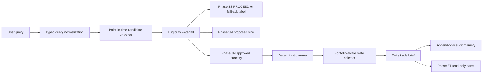

# Phase 3U Personal AI Trader

Phase 3U answers: `What should I trade today?`

This implementation is a disabled-by-default, advisory-only layer. It can create an
immutable daily brief and append recommendation audit events, but it cannot create,
submit, cancel, replace, route, or modify orders.

## Repository Assessment

- UI stack: FastAPI, Jinja templates, static CSS/JS.
- CLI stack: Typer root app in `src/kalshi_predictor/cli.py`.
- Database: SQLAlchemy models in `src/kalshi_predictor/data/schema.py`, with
  `Base.metadata.create_all` for local/dev and Alembic for migrations.
- Market authority: `Market`, `MarketSnapshot`, `Forecast`, and `MarketRanking`.
- Position sizing authority: `PositionSizingDecisionLog` from Phase 3M.
- Risk authority: `AdvancedRiskDecisionLog` from Phase 3N.
- Memory authority: append-only Phase 3O tables plus the new Phase 3U audit table.
- Research context: Phase 3P, 3Q, 3R, 3S, and Phase 3T are consumed read-only.
- Existing exchange/order write paths live outside Phase 3U, notably paper trading,
  autopilot, demo dry-run, and demo execute routes/services.

Missing authoritative fields that prevent full live-advisory completion:

- No authenticated principal/account authorization service.
- No live read-only account service boundary.
- No complete order-book sequence gap contract.
- No fully serving Phase 3S online policy gate.
- No production profile store with effective dating.
- No formal single-flight/rate-limit middleware for expensive advisory scans.

## Architecture



## Policy Versions

- Eligibility policy: `3u-eligibility-v1`
- Ranking policy: `3u-rank-v1`
- Explanation policy: `3u-explain-v1`
- Metric catalog: `3u-metrics-v1`
- Brief schema: `1.0.0`

## Eligibility

Hard gates include:

- Phase 3U enabled and advisory mode selected.
- Market is open/active and has settlement terms.
- Quote, forecast, opportunity, and risk data are fresh.
- Side-aware executable price is available.
- Net EV, ROI, and risk-adjusted EV lower bound clear thresholds.
- Phase 3S does not say `SKIP`.
- Phase 3M proposed quantity is positive.
- Phase 3N decision is not `BLOCK`, quantity is positive, and quantity is not stale.
- User filters narrow only; they cannot rescue failed candidates.

`TRADE_NOTHING` is a valid result and is returned when no candidate survives.

## Ranking

Default deterministic ordering:

1. `incremental_portfolio_utility_lcb` descending
2. `risk_adjusted_ev_lcb_total` descending
3. `expected_net_ev_total` descending
4. `execution_quality` descending
5. `diversification_contribution` descending
6. `model_support` descending
7. `candidate_id` ascending

The slate selector assumes the user may take every displayed recommendation. It
drops redundant same-event recommendations with `REDUNDANT_WITH_HIGHER_RANK`.

## Commands

```bash
kalshi-bot personal-trader-status
kalshi-bot personal-trader-status --enable-advisory

kalshi-bot personal-trader-brief --enable-advisory \
  --output reports/personal_trader_brief.md

kalshi-bot personal-trader-audit
```

## UI And API

- UI: `/personal-trader`
- Query: `POST /personal-trader/query`
- Brief: `GET /personal-trader/briefs/{brief_id}`
- Recommendations: `GET /personal-trader/briefs/{brief_id}/recommendations`
- Recommendation detail: `GET /personal-trader/recommendations/{recommendation_id}`
- Eligibility: `GET /personal-trader/recommendations/{recommendation_id}/eligibility`
- Lineage: `GET /personal-trader/recommendations/{recommendation_id}/lineage`
- Rejections: `GET /personal-trader/briefs/{brief_id}/rejections`
- Profile: `GET /personal-trader/profiles/profile-local-v1`

## No-Write Proof

Phase 3U does not import or call paper-trade, demo-execute, live execution, or
exchange write clients. The only write in Phase 3U is append-only recommendation
memory when a brief is generated with Phase 3U enabled.

## Rollback

Set:

```bash
PHASE_3U_PERSONAL_AI_TRADER_ENABLED=false
PHASE_3U_MODE=DISABLED
```

Rollback preserves immutable briefs and audit events. Core forecasting, learning,
sizing, risk, settlement, paper trading, demo, and UI behavior remain independent.
